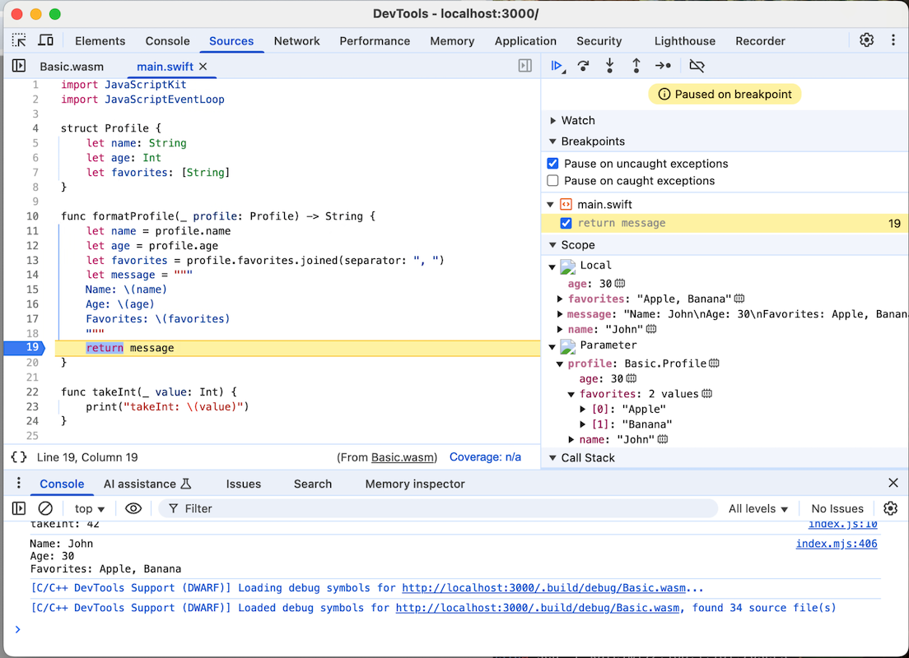

# Debugging

Debugging is one of the most important parts of application development. This section describes debugging tools compatible with SwiftWasm.

These tools are DWARF-based, so you need to build your application with DWARF sections enabled.
If you are using `carton bundle`, you can use the `--debug-info` flag to enable debugging with optimized application.
If you are using `swift build`, it is enabled by default.

## Chrome DevTools

When you are debugging a web browser application, Chrome DevTools is a good tool to use. It allows you to
put breakpoints and step through at Swift source code level.

### Official DWARF Extension

Install [`C/C++ DevTools Support (DWARF)`](https://goo.gle/wasm-debugging-extension) extension in your Chrome

See [the DevTools team's official introduction](https://developer.chrome.com/blog/wasm-debugging-2020) for more details about the extension.


Note that the function names in the stack trace are mangled. You can demangle them using `swift demangle` command.

Unfortunately, variable inspection is unavailable since Swift depends on its own mechanisms to do that instead of DWARF's structure type feature. If you need this feature, you can use the enhanced extension below.

### Enhanced DWARF Extension for Swift

For a better Swift debugging experience, there's also an enhanced version of the DWARF extension specifically for Swift. This extension enables:

- Breakpoint setting and Swift code inspection
- Human-readable call stack frames
- Swift variable value inspection

To install this enhanced extension:

1. First, uninstall the official "C/C++ DevTools Support (DWARF)" extension if you have it installed
2. Download the extension ZIP file from [GitHub Releases](https://github.com/GoodNotes/devtools-frontend/releases/tag/swift-0.2.3.0)
3. Go to `chrome://extensions/` and enable "Developer mode"
4. Drag and drop the downloaded ZIP file into the page

When you close and reopen the DevTools window, DevTools will suggest reloading itself to apply settings.

Note: There is a known issue where some JavaScriptKit types like `JSObject` and `JSValue` are not shown in pretty format in the variables view.



## [wasminspect](https://github.com/kateinoigakukun/wasminspect)

[wasminspect](https://github.com/kateinoigakukun/wasminspect)
can help in the investigation if the debugged binary does not rely on integration with JavaScript.
We recommend splitting your packages into separate executable targets, most of which shouldn't 
assume the availability of JavaScript to make debugging easier.


## [wasm-memprof](https://github.com/kateinoigakukun/wasm-memprof)

If you are debugging memory leaks, [wasm-memprof](https://github.com/kateinoigakukun/wasm-memprof) can help you.
It is a tool to profile memory usage of WebAssembly applications with a few lines of setup code:

```javascript
import { WMProf } from "wasm-memprof";
import { SwiftDemangler } from "wasm-memprof/plugins/swift-demangler.js";

const swiftDemangler = SwiftDemangler.create();
const WebAssembly = WMProf.wrap(globalThis.WebAssembly, {
  demangler: swiftDemangler.demangle.bind(swiftDemangler),
});
```

Check the repository for more details.


