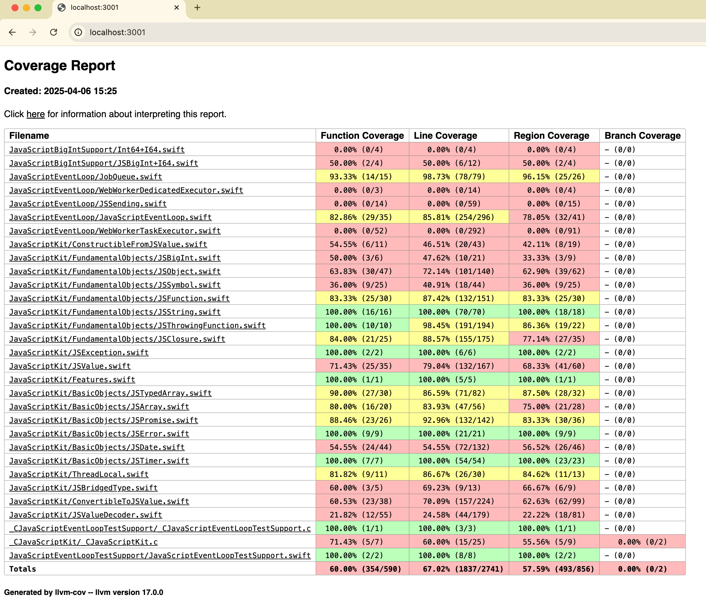

# Testing your app

You can write a test suite for your SwiftWasm app or library, or run an existing test suite
written for `XCTest` if you port existing code to SwiftWasm. Your project has to have a
`Package.swift` package manifest for this to work. We assume that you use SwiftPM to build your
project and that you have a working package manifest. Please follow [our SwiftPM guide](./swift-package.md) for new projects.

## A simple test case

Let's assume you have an `Example` target in your project that you'd like to test. Your
`Package.swift` should also have a test suite target with a dependency on the library target. It
would probably look like this:

```swift
// swift-tools-version: 5.9

import PackageDescription

let package = Package(
    name: "Example",
    products: [
        .library(name: "Example", targets: ["Example"]),
    ],
    targets: [
        .target(name: "Example"),
        .testTarget(name: "ExampleTests", dependencies: ["Example"]),
    ]
)
```

Now you should make sure there's `Tests/ExampleTests` subdirectory in your project.
If you don't have any files in it yet, create `ExampleTests.swift` in it:

```swift
import Example
import XCTest

final class ExampleTests: XCTestCase {
  func testTrivial() {
    XCTAssertEqual(text, "Hello, world")
  }
}
```

This code assumes that your `Example` defines some `text` with `"Hello, world"` value
for this test to pass. Your test functions should all start with `test`, please see [XCTest 
documentation](https://developer.apple.com/documentation/xctest/defining_test_cases_and_test_methods)
for more details.

## Building and running the test suite with `SwiftPM`

You can build your test suite by running this command in your terminal:

```sh
$ swift build --build-tests --triple wasm32-unknown-wasi
```

If you're used to running `swift test` to run test suites for other Swift platforms, we have to
warn you that this won't work. `swift test` doesn't know what WebAssembly environment you'd like to 
use to run your tests. Because of this building tests and running them are two separate steps when
using `SwiftPM`. After your tests are built, you can use a WASI-compatible host such as
[wasmtime](https://wasmtime.dev/) to run the test bundle:

```sh
$ wasmtime --dir . .build/wasm32-unknown-wasi/debug/ExamplePackageTests.wasm
```

(`--dir .` is used to allow XCTest to find `Bundle.main` resources placed alongside the executable file.)

As you can see, the produced test binary starts with the name of your package followed by
`PackageTests.wasm`. It is located in the `.build/debug` subdirectory, or in the `.build/release`
subdirectory when you build in release mode.

## Code coverage with `SwiftPM`

> **Note**: Code coverage support is available only in 6.1 and later.

You can also generate code coverage reports for your test suite. To do this, you need to build your
test suite with the `--enable-code-coverage` and linker options `-Xlinker -lwasi-emulated-getpid`:

```sh
$ swift build --build-tests --swift-sdk wasm32-unknown-wasi --enable-code-coverage -Xlinker -lwasi-emulated-getpid
```

After building your test suite, you can run it with `wasmtime` as described above. The raw coverage
data will be stored in `default.profraw` file in the current directory. You can use the `llvm-profdata`
and `llvm-cov` tools to generate a human-readable report:

```sh
$ wasmtime --dir . .build/wasm32-unknown-wasi/debug/ExamplePackageTests.wasm
$ llvm-profdata merge default.profraw -o default.profdata
$ llvm-cov show .build/wasm32-unknown-wasi/debug/ExamplePackageTests.wasm -instr-profile=default.profdata
# or generate an HTML report
$ llvm-cov show .build/wasm32-unknown-wasi/debug/ExamplePackageTests.wasm -instr-profile=default.profdata --format=html -o coverage
$ open coverage/index.html
```



## Building and running the test suite with `carton`

If you use [`carton`](https://carton.dev) to develop and build your app, as described in [our guide
for browser apps](./browser-app.md), just run `swift run carton test` in the
root directory of your package. This will automatically build the test suite and run it with a WASI runtime for you.
