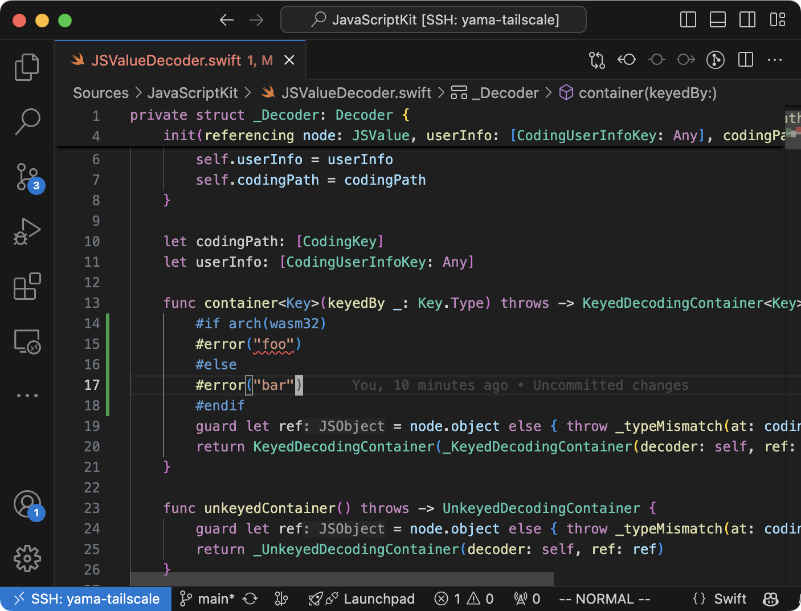

# Configuring Visual Studio Code with WebAssembly SDK

This guide will help you configure Visual Studio Code (VSCode) to use the Swift SDK for WebAssembly.

> **Note**: This guide assumes you have already installed the [Swift SDK for WebAssembly](./setup-snapshot.md) from the development snapshot release.

## Prerequisites

- [Visual Studio Code](https://code.visualstudio.com/)
- [Swift for Visual Studio Code](https://marketplace.visualstudio.com/items?itemName=sswg.swift-lang)
- [Swift OSS Toolchain](https://swift.org/install) (6.1 or later)
- [Swift SDK for WebAssembly](./setup-snapshot.md)


## Configure your SwiftPM package

1. Open your Swift package in VSCode.
2. Create a `.vscode/settings.json` with the following content:

```json
{
    "swift.path": "<path-to-swift-toolchain-from-swift.org>/usr/bin",
}
```

> **Note**: Replace `<path-to-swift-toolchain-from-swift.org>` with the path to the development snapshot Swift toolchain you downloaded from [swift.org/install](https://www.swift.org/install).

3. Create a `.sourcekit-lsp/config.json` with the following content:

```json
{
    "swiftPM": {
        "swiftSDK": "<Swift SDK id>"
    }
}
```

> **Note**: Replace `<Swift SDK id>` with the Swift SDK id you installed using the `swift sdk install` command. You can find the installed SDK id by running `swift sdk list`.

4. Reload the VSCode window by pressing `Cmd + Shift + P` and selecting `Reload Window`.

That's it! You can now build and auto-complete your Swift package using the Swift SDK for WebAssembly.


